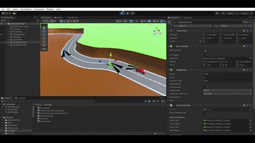

# CarCarDriveDrive (CCDD)
German Below.

## Overview
An easy to use asset for Unity to let cars drive independently on virtual roads. 
This asset is simply dragged and dropped onto the model of the car in the Unity Inspector. The road must be surrounded by a material with the layer "RaycasterRoad". This can be a shoulder or the entire road surface.
The driving behavior can be influenced with a few, easy to understand, parameters.
This software can be used for background driving in games, to run city simulations or as AI in racing games.

## Install Guide:
Download the latest release from the release list.
The package contains a unityproject with some sample scenes (tested with version 2021.3.24f).
### Use of the example scene
When the project is opened with Unity, you will find a simple street parcourse in the SampleScene that shows the function of the script.
Any of the cars can be selected. On the child gameobject "ControlSoftware" you can change the parameters and test the behavior.

### Use the prefab
In the download `CarCarDriveDriveFolder\Unity\Assets\Resources` you can find the Car and Road Prefab. These can simply be dragged into an existing Unity project.
If only the Car is used, the boundary (side strip, underground or extra created object) must be added to the layer "RaycastRoad". Also these objects need a collider.
All objects with this layer will be recognized as obstacles by the CCDD script.

### Self implementation
To implement the scricpt in an own scene with an own vehicle you have to copy all scripts from the folder `CarCarDriveDriveFolder\Unity\Assets\Scripts` into the own project (the TestScript Folder can be omitted).
The control script of your own car must implement the Observer interface.

    public class Ownt: MonoBehaviour, Observer

This requires the implementation of the function CCDDUpdate.
In this function the DriveControllEvent is passed, which contains the three attributes
 - Accelerate (0 to 1)
 - Brake (0 to 1)
 - Steer (-1 to 1; -1 is left)
 
are included. These can be stored in class variables as in the example below to be used elsewhere in the script (e.g. the update method). Alternatively, control commands can be executed there directly.
    
    public void CCDDUpdate(CCDDEvents e)  
    {  
        if (e is DriveControllEvent driveChange)  
    	    {  
    	    _acceleration = driveChange.Accelerate;  
    	    _brakeStrength = driveChange.Brake;  
    	    _targetSteering = driveChange.Steer;  
    	    }  
    }

If the object is currently marked with e.g. manually.

    SteerTheCar(Input.GetAxis("Horizontal"));
After implementing the code above, it can be easily steered using

       SteerTheCar(_targetSteering);
To let the Brain know about the existence of your own vehicle, you have to tell it about yourself. To do this, you have to attach yourself in the OnEnable() function of the control script of your own vehicle and detach yourself in OnDisable().

    void OnEnable()  
    {  
    	GetComponentInChildren<Brain>().Attach(this);  
    }  
    void OnDisable()  
    {  
	    GetComponentInChildren<Brain>().Detach(this);  
    }

#### Prefab
Add the prefab `CarCarDriveFolder\Unity\Assets\Resources\ControllSoftware.prefab`to the own vehicle.

#### Scripts
Instead of the prefab, the scripts "Configuration", "Brain", "Navigator", "SidePressureCalculator" and "Speedometer" can also be added to the vehicle manually.
Configuration, Brain and the Navigator do not necessarily have to be on the vehicle. Then the dependencies in the OnEnable()/OnDisable() methods of the observers must be adjusted.

## Zusammenfassung
Ein einfach zu nutzens Asset für Unity um Autos selbständig auf virtuellen Straßen fahren zu lassen. 
Dieses Asset wird einfach per Drag & Drop auf das Modell des Autos im Unity Inspector platziert. Die Straße muss dabei von einem Material mit dem Layer "RaycasterRoad" umgeben sein. Dies kann ein Seitenstreifen oder auch der gesamte Untergrund sein.
Das Fahrverhalten lässt sich mit wenigen, leicht verständlichen, Parametern beeinflussen.
Diese Software kann für Hintergrundfahrten in Spielen, zur Durchführung von Städtesimulationen oder als KI in Rennspielen eingesetzt werden.

## Installationsanleitung:
Lade die neuste Version von der Releaseliste.
Das Paket enthält ein Unityprojekt mit einer Hand voll Beispielscnene (getestet mit der Version 2021.3.24f).

### Nutzen der Beispielscene
Wenn das Projekt mit Unity geöffnet wird, findet man in der SampleScene einen einfachen StraßenParcourse der die Funktion des Scripts zeigt.
Es kann eins der Autos ausgewählt werden und auf dem Child Gameobject Controllsoftware können die Parameter verändert werden und des Verhalten getestet werden.

### Einbinden des Prefabs
Im Download `CarCarDriveDriveFolder\Unity\Assets\Resources` befindet sich das Car und Road Prefab. Diese können einfach ein Vorhandenes Unity Projekt gezogen werden.
Wenn nur das Car genutzt wird, muss die Seitenbegrenzung (Seitenstreifen, Untergrund oder extra angelegtes Objekt) der Layer "RaycastRoad" hinzugefügt werden. Außerdem benötigen diese Objecte ein Collider.
Alle Objekte mit diesem Layer werden von dem CCDD Script als Hinderniss erkannt.

### Eigene Implementierung
Um das Scricpt ein eine eigene Scene mit eigenem Fahrzeug zu implemntieren müssen alles Script aus dem Ordner `CarCarDriveDriveFolder\Unity\Assets\Scripts` in das eigne Projekt Kopiert werden (Die TestScript können weggelassen werden).
Dem Steuerungsscript des eigenen Fahrzeug muss das Observer Interface implementieren.

    public class Ownt: MonoBehaviour, Observer
Dies verlangt das implemntieren der Funktion CCDDUpdate.
In dieser wird das DriveControllEvent übergeben, welches die drei Attribute
 - Accelerate (0 bis 1)
 - Brake (0 bis 1)
 - Steer (-1 bis 1; -1 ist links)
 
beinhaltet. Diese können wie im Beispiel unten in Klassenvariablen gespeichert werden um an anderer Stelle des Script (z.B. der Updatemethode) verwendet zu werden. Alternativ lassen sich dort auch direkt Steuerbefehle ausführen.

    
    public void CCDDUpdate(CCDDEvents e)  
    {  
        if (e is DriveControllEvent driveChange)  
    	    {  
    	    _acceleration = driveChange.Accelerate;  
    	    _brakeStrength = driveChange.Brake;  
    	    _targetSteering = driveChange.Steer;  
    	    }  
    }
Wenn das Objekt aktuell z.B. mit 

    SteerTheCar(Input.GetAxis("Horizontal"));
manuell gelenkt wird, lässt es sich, nach der implementierung des Codes oben, einfach durch

       SteerTheCar(_targetSteering);

ersetzten.

Damit das Brain von der Existens des eigenen Fahrzeuges weiß, muss man sich diesem noch mitteilen. Dafür sollte man sich in der OnEnable() Funktion des Steuerungsscript des eigenen Fahrzeuges Attachen und in OnDisable() Detachen.

    void OnEnable()  
    {  
    	GetComponentInChildren<Brain>().Attach(this);  
    }  
    void OnDisable()  
    {  
	    GetComponentInChildren<Brain>().Detach(this);  
    }

#### Prefab
Das Prefab `CarCarDriveDriveFolder\Unity\Assets\Resources\ControllSoftware.prefab`dem eigenen Fahrzeug hinzufügen.

#### Scripts
Statt des Prefabs können auch die Scripts "Configuration", "Brain", "Navigator", "SidePressureCalculator" und "Speedometer" manuell dem Fahrzeug hinzugefügt werden.#
Configuration, Brain und der Navigator müssen dabei nicht zwangsläufig auf dem Fahrzeug liegen. Dann müssen die Abhängigkeiten in den OnEnable()/OnDisable() Methoden der Observer angepasst werden.
